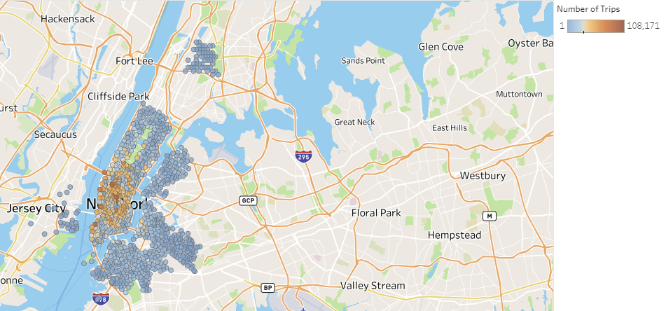

# Tableau-Challenge

##### Tableau Analysis: https://public.tableau.com/views/CitiBikeAnalysis_16000362918540/CitiBikeAnalysis?:language=en&:display_count=y&publish=yes&:origin=viz_share_link

## Location of Final Destination:
### In this Dataset, the majority of the final destination spot of most citi bike trips in 2019 were in Manhatten. Sesifically the most travelled to destination was Pershing squre north. This is due to the Grand Central station that is no more than a block away. 

## Customer Analysis:
### The vast majority of customer are subscribed users. The persentage split of subsribers to nonsubscribers is around %15 non subscribers. The gender breakdown of users are predominantly male with about %33 of the user base to be women. This could be due to the risky nature of the mode of transportation. 
