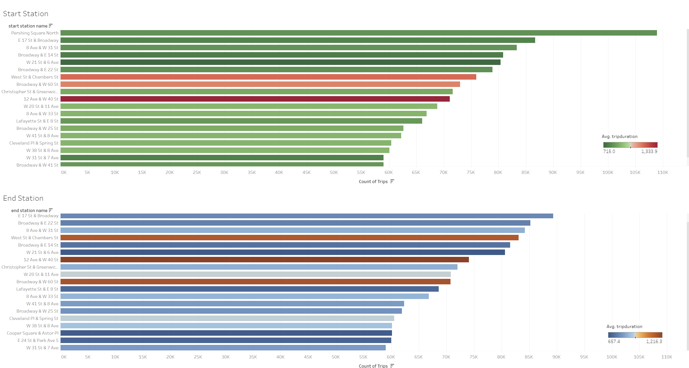
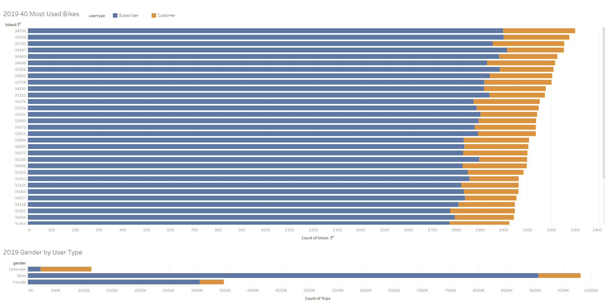
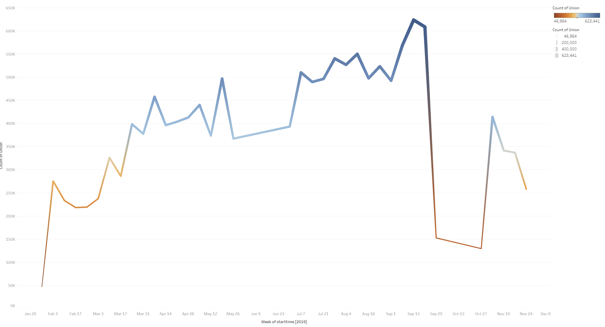
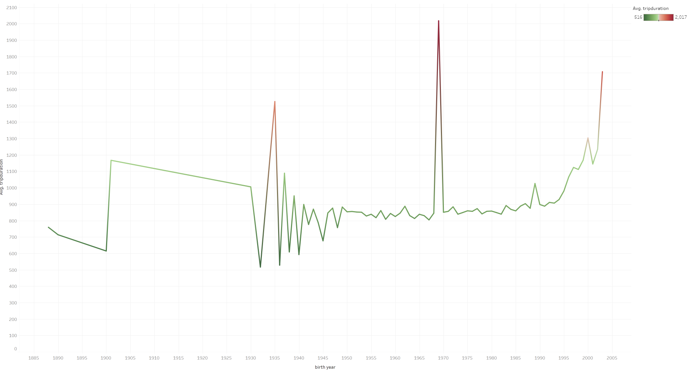

# Tableau-Challenge

##### Tableau Analysis: https://public.tableau.com/views/CitiBikeAnalysis_16000362918540/CitiBikeAnalysis?:language=en&:display_count=y&publish=yes&:origin=viz_share_link

## Overview:
#### In this project, I assumed the role of an analyst for the Citi Bike program of New York city. My task was to glean insights into the 2019 transit patterns of each bike and user analysis utilizing Tableau. The data was extracted from the Citi Bike open data source (https://www.citibikenyc.com/system-data). 

## Bike Transit Patterns:
### Through my analysis, discoveries were made showing that most bikes were used to travel to destinations in Manhattan considerably more than any other burrow of New York in 2019. This is due to the several iconic destinations of Manhattan which these stations are located near.  This can be exemplified by the top three most travelled to station. First the most travelled to station was Pershing Square north which is located just a block from the iconic Grand Central station. There could be a correlation between train and bike users. The next most travelled to station is located at E 17th and Broadway which is near the historic Union Square. Lastly, the third most travelled to station is Broadway and E 22nd St which is near Madison Square Park. These three iconic destinations draw Citi Bike users. Utilizing this information Citi Bike could gain more revenue through in app advertising for businesses in areas with heavy station traffic. 

### Destination Station Heat Map:

### Station Analysis:

## User Analysis:
### The vast majority of customer are subscribed users. The percentage split of subscribers to nonsubscribers is around %15 non-subscribers. The gender breakdown of users is predominantly male with about %33 of the user base to be women. This could be due to the risky nature of the mode of transportation. The weekly data chart shows that more bikes are used when the weather is warmer. 

